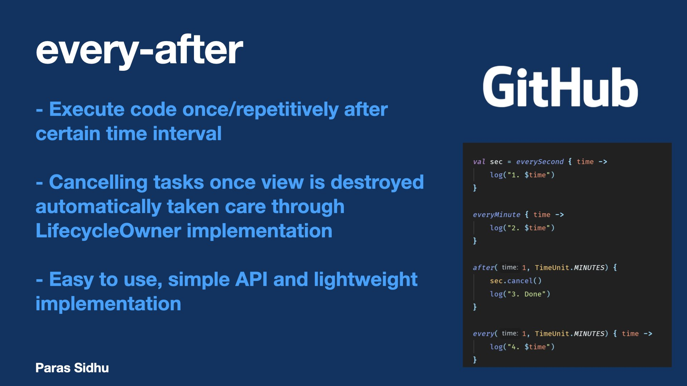

# Introduction

every-after is an Android library to run a piece of code (optionally repetitively) after certain time interval. It exposes extension functions on `LifecycleOwner` to achieve this.

### **Star :star:  this repo to show your support and it really does matter!** :clap:

# Documentation

| Function | Description |
| ------ | ------ |
| LifecycleOwner.every(time, unit, action) | Executes `action` after each `time` in `unit` units. Example: `time=2` `unit=seconds` implies every 2 seconds |
| LifecycleOwner.everySecond(action) | Executes `action` every second |
| LifecycleOwner.everyMinute(action) | Executes `action` every minute |
| LifecycleOwner.after(time, unit, action) | Executes `action` *once* after `time` in `unit` units |

# Integration

1. In the project-level `build.gradle`:

```
allprojects {
   repositories {
      ...
      maven { url 'https://jitpack.io' }
    }
}
```

2. In app-level `build.gradle`: [](https://jitpack.io/#sidhuparas/every-after)

```
dependencies {
     implementation 'com.github.sidhuparas:every-after:<latest-version>'
}
```

# FAQ

1. **I can use `Handler` to replicate `after` function's functionality. Why should I need `after` function or this library?**
Ans: Handler is often known to cause memory leaks when used carelessly. With every-after, you don't need to take care of cancelling the task if activity or fragment is destroyed. It is automatically taken care.

2. **Can I cancel tasks on my own?**
Ans: Yes, each function returns an object which has `Cancellable` interface implemented. Just call `cancel()` function on it to cancel the task.

3. **I don't have LifecycleOwner object access. I can cancel the task on my own. Can I use the functions without LifecycleOwner?**
Ans: Currently, no. Coming soon.

# Contributions

- Fork the repo
- Create a new branch and make changes
- Push the code to the branch and make a PR! :thumbsup:

# License

MIT License

Copyright (c) 2021 Paras Sidhu

Permission is hereby granted, free of charge, to any person obtaining a copy
of this software and associated documentation files (the "Software"), to deal
in the Software without restriction, including without limitation the rights
to use, copy, modify, merge, publish, distribute, sublicense, and/or sell
copies of the Software, and to permit persons to whom the Software is
furnished to do so, subject to the following conditions:

The above copyright notice and this permission notice shall be included in all
copies or substantial portions of the Software.

THE SOFTWARE IS PROVIDED "AS IS", WITHOUT WARRANTY OF ANY KIND, EXPRESS OR
IMPLIED, INCLUDING BUT NOT LIMITED TO THE WARRANTIES OF MERCHANTABILITY,
FITNESS FOR A PARTICULAR PURPOSE AND NONINFRINGEMENT. IN NO EVENT SHALL THE
AUTHORS OR COPYRIGHT HOLDERS BE LIABLE FOR ANY CLAIM, DAMAGES OR OTHER
LIABILITY, WHETHER IN AN ACTION OF CONTRACT, TORT OR OTHERWISE, ARISING FROM,
OUT OF OR IN CONNECTION WITH THE SOFTWARE OR THE USE OR OTHER DEALINGS IN THE
SOFTWARE.
